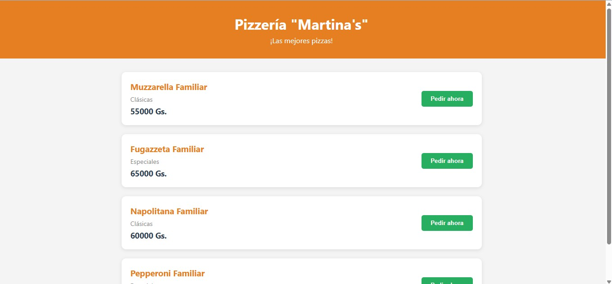
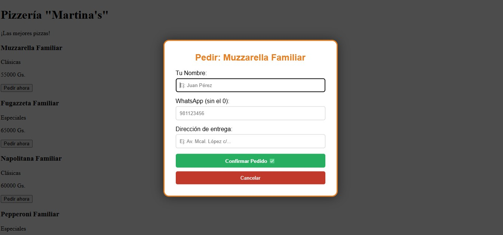
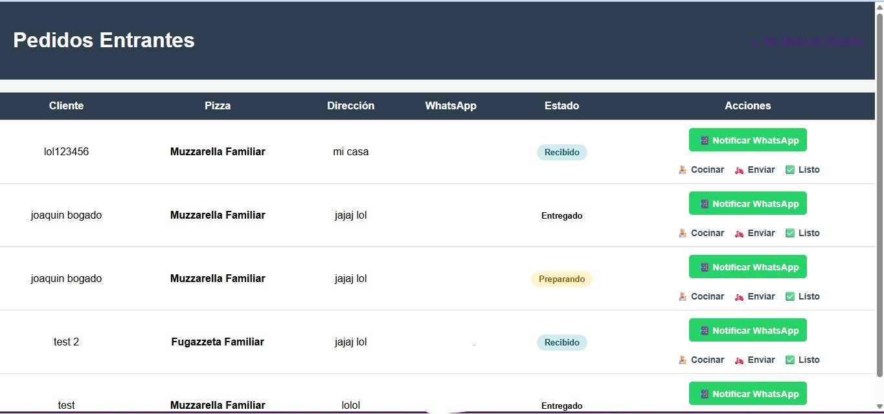
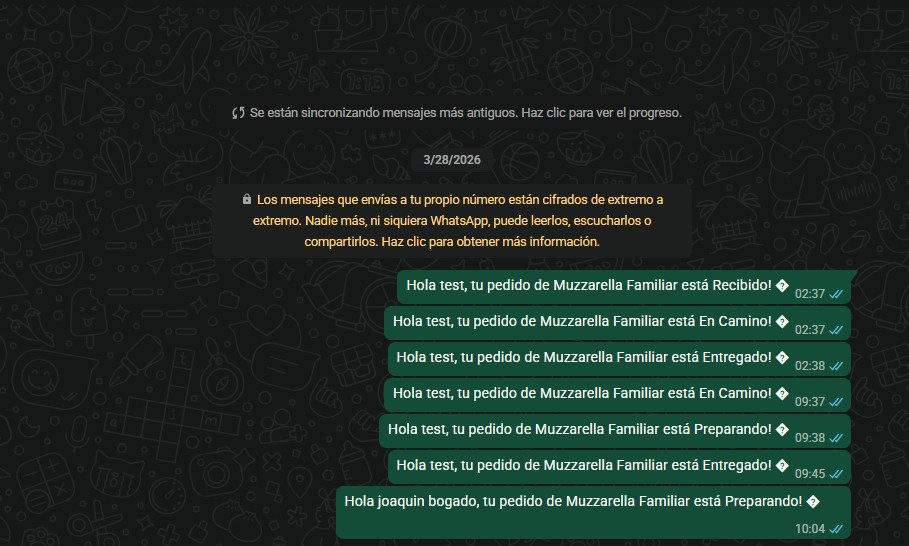

# Martina's - Sistema de Gestión Gastronómica

Sistema de gestión para pizzerías desarrollado con **Python** y **Flask**, enfocado en la automatización de pedidos, inventario y comunicación con clientes.

## 🔗 Demo en vivo

👉 **[https://pizzeriav2.onrender.com](https://pizzeriav2.onrender.com)**

> Nota: al ser un plan gratuito de hosting, el primer acceso puede tardar unos segundos en cargar si el servicio estuvo inactivo.

## 📸 Capturas de pantalla

### Catálogo de productos (cliente)


### Modal de pedido


### Panel de administración


### Notificación automática por WhatsApp


## ✨ Funcionalidades

- **Catálogo interactivo**: los clientes navegan el menú y hacen pedidos sin necesidad de registro.
- **Panel de administración**: control centralizado de pedidos con estados (Recibido, Preparando, En Camino, Entregado).
- **Notificaciones automáticas por WhatsApp**: el cliente recibe un mensaje cada vez que cambia el estado de su pedido.
- **Gestión de inventario (en desarrollo)**: base de datos relacional en SQLite para el seguimiento de ingredientes.
- **Arquitectura modular**: separación clara de responsabilidades (routes, logic, database).

## 🛠️ Stack técnico

- **Lenguaje:** Python 3.x
- **Framework web:** Flask
- **Base de datos:** SQLite
- **Frontend:** HTML5, CSS3, Jinja2 Templates
- **Deploy:** Render (Gunicorn como servidor de producción)
- **Notificaciones:** API de WhatsApp

## 🗺️ Roadmap

- [ ] Descuento automático de stock basado en recetas
- [ ] Alertas de cantidad mínima para reabastecimiento
- [ ] Reportes de ventas diarios

## 🚀 Instalación local

1. Clonar el repositorio:
```bash
   git clone https://github.com/JoaquinBogado00/pizzeriav2.git
   cd pizzeriav2
```

2. Crear y activar un entorno virtual:
```bash
   python -m venv venv
   venv\Scripts\Activate.ps1   # Windows (PowerShell)
```

3. Instalar dependencias:
```bash
   pip install -r requirements.txt
```

4. Inicializar la base de datos:
```bash
   python init_db.py
   python seed.py
```

5. Ejecutar la app:
```bash
   python app.py
```

6. Abrir en el navegador: `http://localhost:5000`

## 📁 Estructura del proyecto

```
pizzeriav2/
├── app.py
├── init_db.py
├── seed.py
├── requirements.txt
├── database/
│   ├── connection.py
│   └── schema.sql
├── routes/
├── static/
│   ├── style.css
│   └── admin.css
└── templates/
    ├── index.html
    └── admin.html
```
